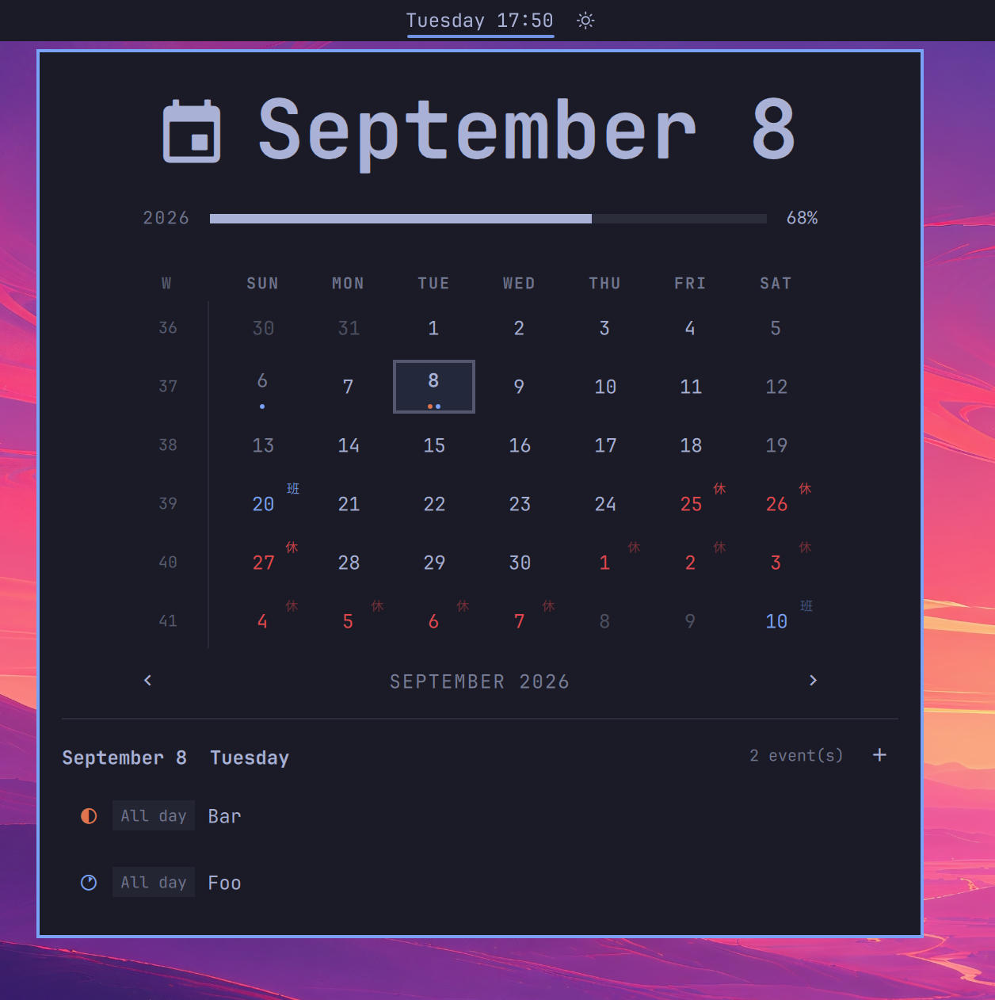
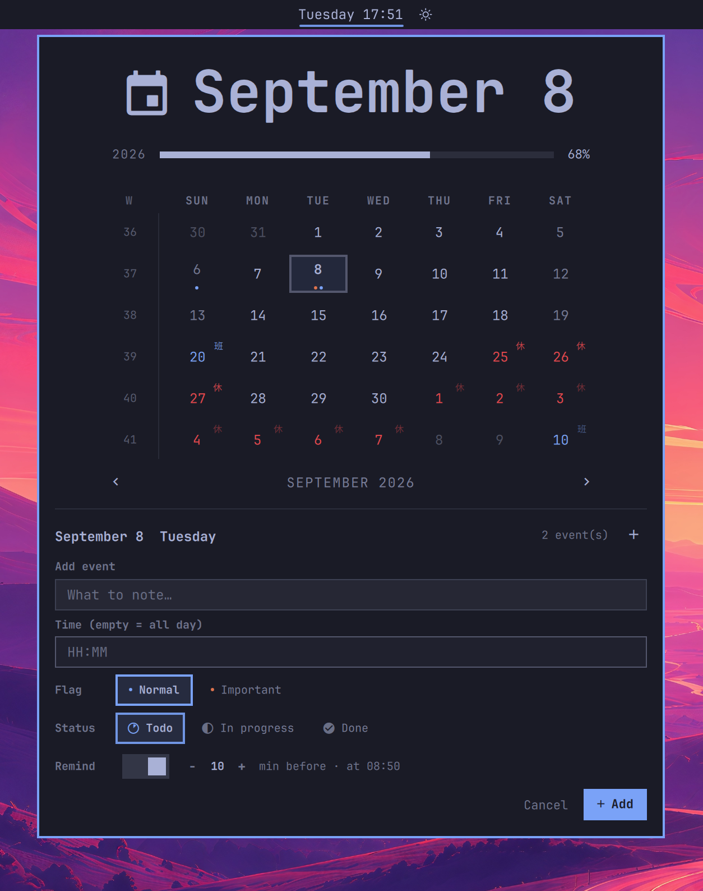

# Xechoz Calendar(xechoz.clock)

Omarchy bar 时钟 + 月历 + **事件日历**(带待办/提醒)插件。

> **Xechoz Calendar** is a date/time bar widget for
> [Omarchy Quattro](https://github.com/omacom/omarchy/tree/quattro) with a
> calendar popup, per-day events and desktop reminders. Click any day to add
> all-day / timed / repeating events, cycle 待办→进行中→已完成 statuses, and
> get notified before they are due. Chinese public holidays (放假/调休) are
> marked automatically when your system is in a Chinese context.
>
> Install from the [Omarchy plugin marketplace](https://plugins.omarchy.org/):
>
> ```sh
> omarchy plugin add https://github.com/xechoz/CalendarEvent.git --enable --yes
> ```

<p>
  
  
</p>

克隆自 Omarchy 内置 `omarchy.clock`,扩展为可管理事件的日历:每个日期下可记录
全天/多日/定时/重复事件,附带 待办→进行中→已完成 状态与到点桌面提醒。

> Derived from the built-in `omarchy.clock` plugin of the Omarchy desktop
> (https://omarchy.org/). See LICENSE for provenance. MIT licensed.

## 功能

- **时钟**:左键弹出日历,右键切换显示格式(格式/周起始写入 shell.json,重启保留),中键打开时区选择
- **月历**:6 行月网格、今天高亮/选中日描边、有事件的日子显示红/绿圆点(重要=红)
- **节假日**:标记中国法定节假日 —— 放假日红色数字+"休"、调休上班日蓝色数字+"班",悬停/选中显示节名(默认对中文/中国区/UTC+8 用户开启,可 `holidays` 设置关闭)
- **事件**:点击任意一天,下方管理当日安排 —— 标题 / 起止日期(多日)/ 时间(留空=全天);支持 每天/每周/每月/每年 重复(可设截止日期、可按天跳过某次出现)
- **状态**:每个事件三态 待办(空心圆)/ 进行中(半圆)/ 已完成(实心圆,蓝);列表行首圆点一键切换
- **提醒**:到点前 n 分钟桌面通知(n 可在 5/10/15/30/60 分钟档位间选,默认 10);定时事件以事件时刻为锚,全天事件锚定当天 09:00;多日只在首日;自动去重,不会重复弹
- **快捷键**:面板内 `A` 新建事件、`Esc` 关闭表单、`Del` 删除选中、`t` 回到今天、`w` 切换周起始
- **多语言**:界面支持中文 / 英文,默认跟随系统语言;可在 shell.json 内联设置 `language` 强制指定(见下)

## 语言(language 设置)

面板与提醒文案经 `i18n/I18n.qml` 单例翻译,语言按以下规则解析:

- 缺省 / `"auto"` / 空:跟随系统 `Qt.locale()`(zh* → 中文,其余 → 英文)
- `"zh"` / `"zh_CN"`:强制中文;`"en"` / `"en_US"`:强制英文

在 shell.json 的 xechoz.clock 条目中直接写扁平键即可(修改后重启 shell 生效):

```json
{ "id": "xechoz.clock", "language": "en" }
```

## 中国节假日(holidays 设置)

日历格会标记中国法定节假日(国务院安排):放假日在日期数字下方用红色数字 +
"休" 角标,调休上班日用蓝色数字 + "班" 角标;悬停显示节名,选中日头部追加节名。

- 缺省 / `"auto"`:智能默认 —— 系统语言为中文、系统 locale 为中国区、
  或时区为 UTC+8(中国全域)时自动开启,否则关闭
- `"on"` / `"off"`:强制开启 / 关闭

```json
{ "id": "xechoz.clock", "holidays": "off" }
```

数据来源:[NateScarlet/holiday-cn](https://github.com/NateScarlet/holiday-cn)(MIT,
依据 gov.cn 官方通知)。2026 全年数据内置在 `calendar/Holidays.js`;查看 2026 之后的
年份时联网拉取同一仓库(每会话每缺失年份一次,失败静默、离线时仅无标记)。
2027+ 数据一经国务院公布并收录进该仓库,翻到对应月份即自动出现,无需升级插件。

## 安装

```bash
omarchy plugin add https://github.com/xechoz/CalendarEvent.git --enable --yes
```

- 无 `--yes` 时按提示确认即可;会询问放入 bar 哪个区,建议选 **center**
- 安装后自动出现在 bar 上;可用 `omarchy bar move xechoz.clock --section center` 调整
- 若想替换原内置时钟:在 `~/.config/omarchy/shell.json` 把 `bar.centerAnchor`
  改为 `"xechoz.clock"`,并把原 `omarchy.clock` 布局条目移除(文件热重载)

### 手动安装

把整个目录放到 `~/.config/omarchy/plugins/xechoz.clock/`,然后:

```bash
omarchy-shell shell rescanPlugins
omarchy plugin enable xechoz.clock
```

## 更新 / 卸载

```bash
omarchy plugin update xechoz.clock    # git 管理的插件可增量更新
omarchy plugin remove xechoz.clock    # 只移除插件本体
```

卸载后如需恢复内置时钟:用 `omarchy bar` 或直接在 shell.json 里加回 `omarchy.clock` 条目。

## 依赖

均为 Omarchy 自带或其依赖,无需额外安装:

- `python3`:事件数据的原子读写(`events/events_sync.py`)
- `curl`:查看 2026 之后年份的节假日数据时联网拉取;断网时内置的 2026
  全年数据照常显示
- `omarchy-notification-send`:到点桌面通知(Omarchy 系统件)

## 数据

- 事件:`~/.local/share/omarchy-calendar/events.json`
- 提醒去重:`~/.local/share/omarchy-calendar/notified.json`

数据独立于插件本体,卸载/重装不会清空;备份时带上这两个文件即可。

## 诊断

```bash
omarchy-shell xechoz.clock eventsDebug   # 数据加载/计数/布局自检
omarchy restart shell                    # 大改后强制重载
```

插件代码运行在 `omarchy-shell` 进程内(非沙箱),安装第三方插件前请自行审阅代码。

## 开发

- 逻辑与 UI 分层:`events/EventsModel.js`(纯 JS,可 node 单测)、`events/events_sync.py`
  (原子 JSON 读写后端),其余为 QML
- 多语言:`i18n/I18n.qml`(QML 单例字典 + `tr(key, args)`;绑定依赖 `I18n.lang`,
  运行时切换语言无需重启即可生效)
- 节假日:`calendar/Holidays.js`(内置 2026 + 解析,纯 JS 可 node 单测)+
  `calendar/HolidayStore.qml`(联网拉取后续年份)
- 布局结构:`Panel.qml` 协调层 → `calendar/CalendarContent.qml`(月历)+
  `events/DayEvents.qml`(当日事件区)+ `reminders/ReminderEngine.qml`(提醒)
